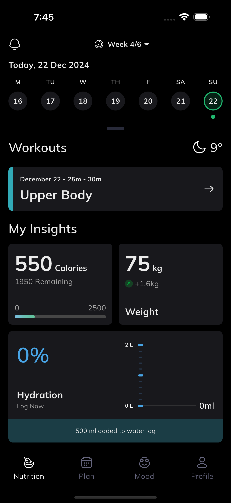
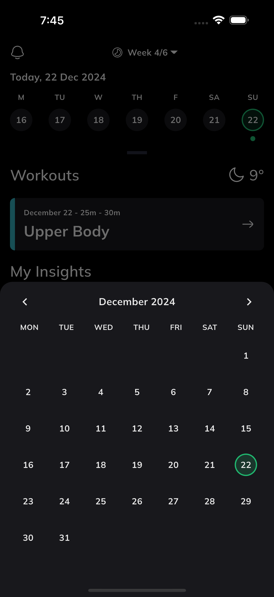
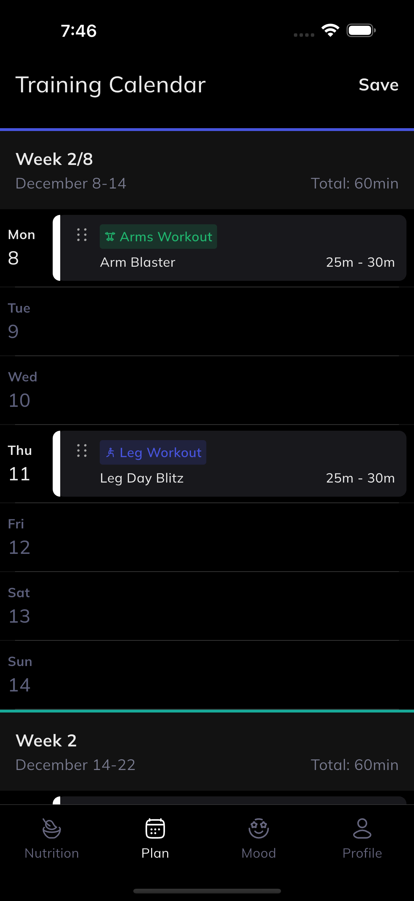
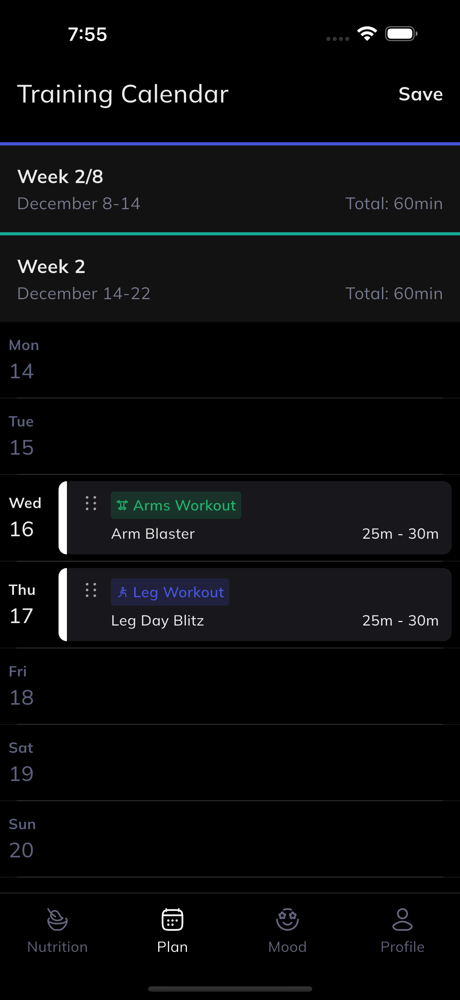
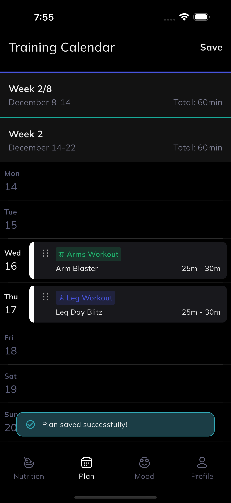
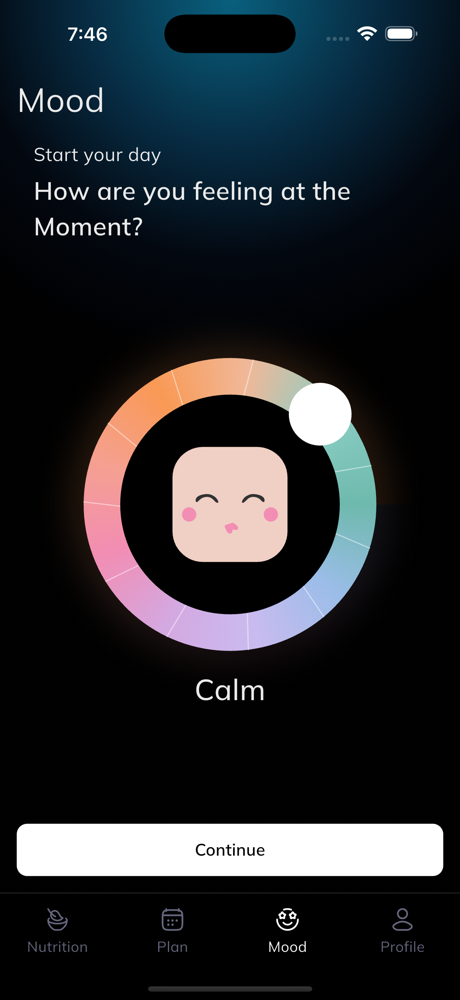
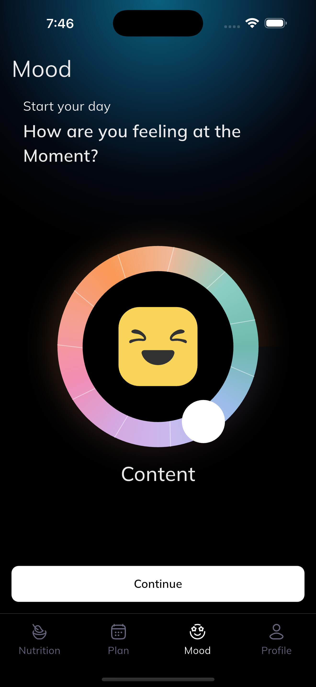
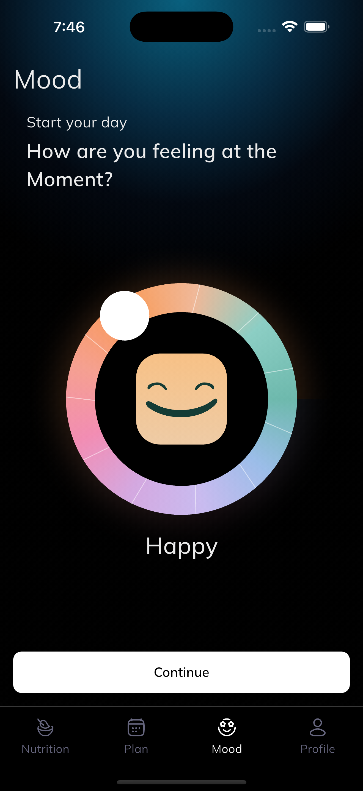
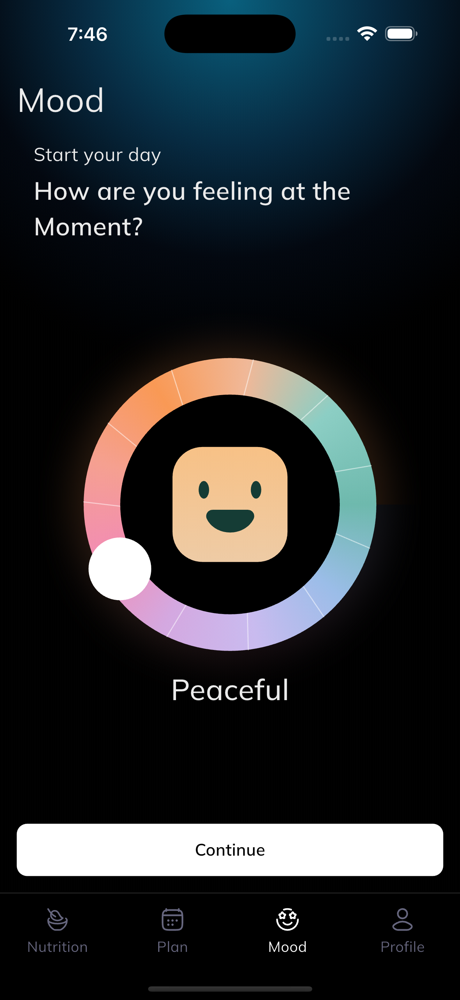
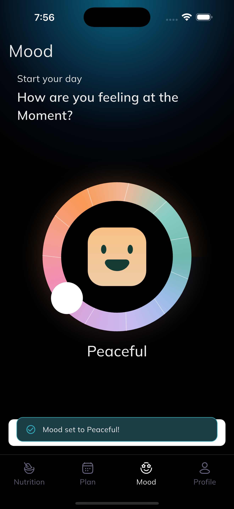

# Fitness App

A modern fitness tracking mobile application built with Flutter, implementing Clean Architecture and BLoC state management pattern.

---

## App Screenshots

| Nutrition                               | Calendar                              | Plan                          |
| --------------------------------------- | ------------------------------------- | ----------------------------- |
|  |  |  |

| Plan Updated                                  | Plan Saved                                | Calm Mood                               |
| --------------------------------------------- | ----------------------------------------- | --------------------------------------- |
|  |  |  |

| Content Mood                             | Happy Mood                           | Peaceful Mood                              | Mood Saved                           |
| ---------------------------------------- | ------------------------------------ | ------------------------------------------ | ------------------------------------ |
|  |  |  |  |

---

## App Demo Video

[Watch App Demo Video](https://drive.google.com/file/d/1Mlolj_ZORNbMcVPiuMoa89rBjz7yVLPj/view?usp=sharing)

---

## Download APK

[Download APK](https://github.com/FahadMehmood056/fitness_app/releases/download/v1.0.0/app-release.apk)

---

## Dependencies Used & Why

| Package              | Version | Purpose                                                     |
| -------------------- | ------- | ----------------------------------------------------------- |
| `flutter_bloc`       | ^9.1.1  | State management using BLoC pattern                         |
| `bloc`               | ^9.2.1  | Core BLoC library for events, states and bloc classes       |
| `go_router`          | ^17.2.3 | Declarative routing with shell routes for bottom navigation |
| `flutter_svg`        | ^2.3.0  | Rendering SVG icons and assets                              |
| `flutter_gen`        | ^5.14.1 | Auto-generates type-safe asset references                   |
| `build_runner`       | latest  | Required to run flutter_gen code generation                 |
| `flutter_gen_runner` | latest  | Flutter Gen code generation runner                          |

---

## Project Structure

```
lib/
├── core/
│   ├── constants/
│   │   ├── app_colors.dart
│   │   └── app_text_styles.dart
│   ├── router/
│   │   └── app_router.dart
│   ├── theme/
│   │   └── app_theme.dart
│   ├── utils/
│   │   └── sb.dart
│   └── widgets/
│       ├── app_loader.dart
│       ├── app_snack_bar.dart
│       └── bottom_nav_shell.dart
│
├── features/
│   ├── nutrition/
│   │   └── presentation/
│   │       ├── bloc/
│   │       │   ├── nutrition_bloc.dart
│   │       │   ├── nutrition_event.dart
│   │       │   └── nutrition_state.dart
│   │       ├── pages/
│   │       │   └── nutrition_page.dart
│   │       └── widgets/
│   │           ├── nutrition_top_bar_widget.dart
│   │           ├── nutrition_date_header_widget.dart
│   │           ├── week_strip_widget.dart
│   │           ├── month_calendar_widget.dart
│   │           ├── workouts_section_widget.dart
│   │           ├── workout_card_widget.dart
│   │           ├── insights_section_widget.dart
│   │           ├── calories_card_widget.dart
│   │           ├── weight_card_widget.dart
│   │           ├── hydration_card_widget.dart
│   │           └── water_chart_widget.dart
│   │
│   ├── plan/
│   │   └── presentation/
│   │       ├── bloc/
│   │       │   ├── plan_bloc.dart
│   │       │   ├── plan_event.dart
│   │       │   └── plan_state.dart
│   │       ├── pages/
│   │       │   └── plan_page.dart
│   │       └── widgets/
│   │           ├── plan_top_bar_widget.dart
│   │           ├── plan_week_section_widget.dart
│   │           └── plan_day_tile_widget.dart
│   │
│   ├── mood/
│   │   └── presentation/
│   │       ├── bloc/
│   │       │   ├── mood_bloc.dart
│   │       │   ├── mood_event.dart
│   │       │   └── mood_state.dart
│   │       ├── pages/
│   │       │   └── mood_page.dart
│   │       └── widgets/
│   │           ├── mood_top_bar_widget.dart
│   │           ├── mood_question_widget.dart
│   │           ├── mood_ring_widget.dart
│   │           ├── mood_gradient_widget.dart
│   │           └── mood_continue_button_widget.dart
│   │
│   └── profile/
│       └── presentation/
│           └── pages/
│               └── profile_page.dart
│
├── gen/
│   ├── assets.gen.dart
│   └── fonts.gen.dart
│
└── main.dart

assets/
├── fonts/
└── icons/
```

### Folder Descriptions

| Folder                | Description                                      |
| --------------------- | ------------------------------------------------ |
| `core/constants/`     | App-wide colors and text styles                  |
| `core/router/`        | Navigation and routing configuration             |
| `core/theme/`         | App theme setup                                  |
| `core/utils/`         | Helper utilities                                 |
| `core/widgets/`       | Reusable widgets shared across features          |
| `features/nutrition/` | Home screen with calendar, workouts and insights |
| `features/plan/`      | Training calendar with drag and drop             |
| `features/mood/`      | Mood tracker with interactive ring               |
| `features/profile/`   | User profile screen                              |
| `gen/`                | Auto-generated asset references                  |
| `assets/fonts/`       | Mulish font family files                         |
| `assets/icons/`       | SVG icon files                                   |

_Developed by Fahad Mehmood — Flutter Developer_
